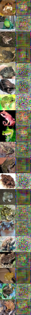
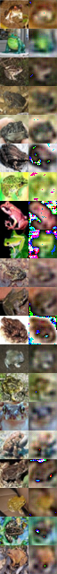
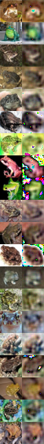

## Variational Autoencoder (VAE) on CIFAR10 with Pytorch

epoch 1,50, 100, 150, 200, 250, 300, 300

#### Some Crucial Tips

1. Recall that the  objective is to maximize E_q \log p(x|z) -KL(q|p). For the first item, if we use MSE reconstruction loss, then we assume that the likelihood follows a Gaussian  in the output space. Therefore, there must be a weight parameter before the reconstruction loss or KL divergence. Say that, suppose the std is 0.01, then the weight for KLD (\beta) should be 1e-4.  if the std is 1, then the weight should be 1, leading to much more terrible results.
2. Set size_average=False in the loss function, or further decrease the weight parameter for KLD.
3. We do not apply the sigmoid function.

#### Instructions

python cifar_vae.py
